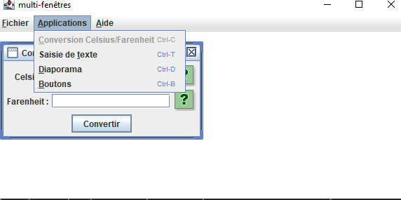
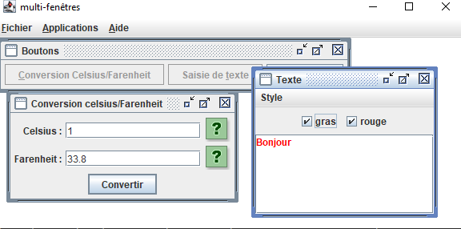

# Projet de Conversion Celsius/Fahrenheit et Écriture de Texte

## Description

Ce projet Java utilise des interfaces graphiques créées avec **JFrame** pour offrir plusieurs fonctionnalités :
1. **Conversion Celsius/Fahrenheit** : Une interface utilisateur permettant de convertir des températures entre Celsius et Fahrenheit.
2. **Saisie de texte** : Une interface pour saisir du texte avec des options de style, telles que le format gras ou la couleur rouge.

## Fonctionnalités

### 1. Conversion Celsius/Fahrenheit
- L'utilisateur entre une température en Celsius, et l'application calcule et affiche la température correspondante en Fahrenheit.
- Interface intuitive avec boutons et champs de saisie.

### 2. Saisie de Texte
- Permet à l'utilisateur de saisir du texte et de lui appliquer des styles comme du gras ou une couleur rouge.
- L'interface est simple à utiliser et intuitive.

## Capture d'écran principale

Voici une vue d'ensemble de l'application, affichant les différentes fenêtres et fonctionnalités accessibles via le menu.

## Comment utiliser

1. **Conversion Celsius/Fahrenheit** : Naviguez vers le menu **Applications > Conversion Celsius/Fahrenheit** ou utilisez le raccourci `Ctrl+C`.
2. **Saisie de texte** : Naviguez vers le menu **Applications > Saisie de texte** ou utilisez le raccourci `Ctrl+T`.

## Prérequis :
- Java (JDK 8 ou supérieur)
- Une bibliothèque graphique  **Swing**

